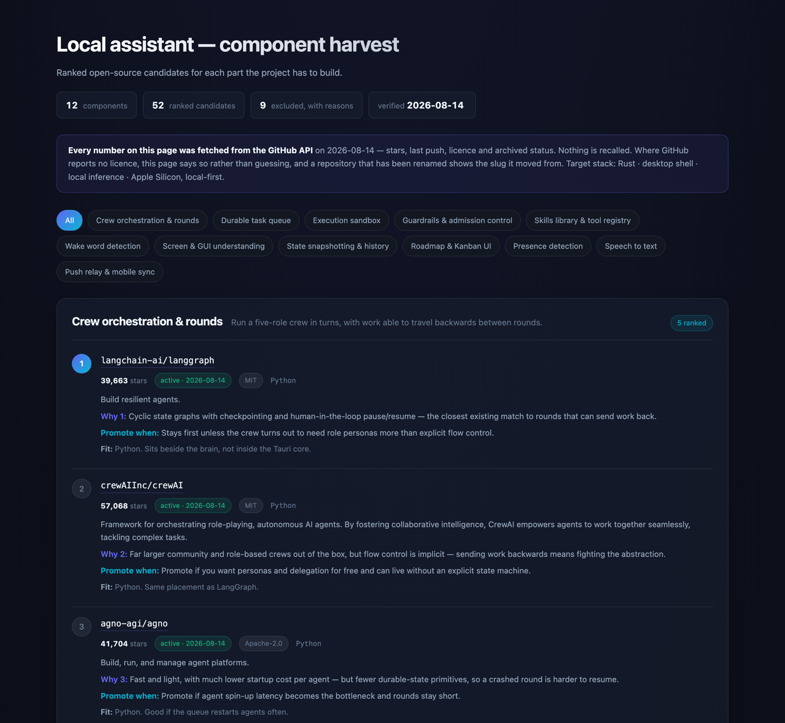

<div align="center">


# Blindspot

**A Claude skill that turns an idea — or a half-planned project — into something you can actually build.**

Named for what it hunts: the two things nobody can self-report — what you assumed was too obvious to say,
and what you never thought of at all.

One question at a time, until the unknowns run out. Then real components, with real numbers.

[Install](#install) · [How it works](#how-it-works) · [The method](#the-method) · [Depth levels](#three-depths-chosen-up-front) · [Hunt scope](#two-scopes-asked-before-searching) · [Why it verifies](#why-the-harvest-verifies-everything) · [Examples](examples/)

</div>

---

## The problem

You arrive with one sentence: *"an app that helps dog walkers find clients."*

A plan written straight from that sentence is fiction. Every decision that matters — who signs in, what
happens offline, who pays, what "done" means — gets made by whoever writes the plan, not by the person who
has to live with it. Ask a model to spec it and you get a confident document full of choices you never made.

The other version of the same problem: **a project already underway** that was never planned properly. Code,
momentum, and a growing sense that something is missing. By the time anyone notices, the gaps are
load-bearing.

This skill handles both.

## How it works

Two phases, and each opens by asking you one thing before it starts — the depth to run at, then the scope to
hunt at. Both are cheap to answer and expensive to get wrong.

| | **Phase 1 — the interview** | **Phase 2 — the harvest** |
|:--|:--|:--|
| **What happens** | one question per message until the unknowns stop appearing | real open-source candidates found and verified for each part |
| **Asks first** | [which depth](#three-depths-chosen-up-front) — beginner, moderate, pro | [which scope](#two-scopes-asked-before-searching) — components, or anything that saves work |
| **You get** | `<slug>-blueprint.md` | `<slug>-harvest.html` |

**Phase 1** is one question per message — not a form, not a batch of five. People answer forms shallowly, and
shallow answers are exactly the ones that produce a wrong build. Every answer is written to disk as it
arrives, because a long interview outlives the context window.

**Phase 2** takes each part the blueprint needs and finds real projects for it, **verifying** every one —
stars, last commit, licence, platform — before recommending anything.

You end with two files: a blueprint containing your own decisions, and a dashboard of components whose
numbers were fetched rather than remembered. Both are in [`examples/`](examples/).



## The method

Built on Thariq's four-quadrant framing of unknowns. The useful part is that **each quadrant is found by a
different move** — knowing which move produces which quadrant is the whole technique.

| | You can state it | You cannot state it |
|:--|:--|:--|
| **You know it** | **known known** — direct questions | **unknown known** — you explain something you assumed was obvious |
| **You don't** | **known unknown** — your own deferrals | **unknown unknown** — collisions between your answers |

The bottom-right box is the one worth paying for, and **open questions never produce it.** You cannot ask
someone "what haven't you thought of?" It appears when two things you already said are placed side by side
and cannot both be true:

> Two of your answers pull against each other. You want it to work with no internet, and you want reminders
> on your phone. Push notifications need a network. Which gives?

In the interview this skill was built from, *every single* unknown-unknown came from a collision like that,
and none came from an open question. So the skill hunts collisions first and falls back to open questions
only when it cannot find one.

A collision is never a gotcha. Presented as a fork with real consequences on both sides, people usually
produce a third option better than either — which is the point.

### Two ways in

**From nothing.** One sentence and an intention.

**From a project already underway.** The skill reads what exists first — README, plan docs, issues, layout,
recent commits — and fills the blueprint from those artefacts, marking each entry **"from your docs"** rather
than **"from you"**. That distinction earns its keep immediately: a decision written in a document nobody has
revisited in six months is not the same as one you just confirmed, and the gap between them is often the
thing you came to find. Then it opens with a contradiction between two decisions made months apart — because
nobody sees those from the inside.

Expect that version to run *longer* than starting from scratch. An existing project brings its own
contradictions with it.

### Three depths, chosen up front

Asked in the first message, because getting it wrong wastes the interview: a beginner asked about durability
guarantees goes quiet, and an expert asked "phone or computer?" stops answering properly.

| | **1 — Absolute beginner** | **2 — Moderate** | **3 — Pro** |
|:--|:--|:--|:--|
| **Questions** | always two plain options, each with what it costs | choices for technical decisions, open for product ones | open questions, blunt trade-offs |
| **Jargon** | none | glossed in a clause | assumed |
| **Depth** | what it does and who for | local or hosted, web or app, who pays | failure modes, concurrency, durability, licences |
| **Collisions** | raised gently | raised plainly | chased hard |
| **Rough length** | 20–35+ | 45–70+ | 80–120+ |

Move between levels at any time by saying *"simpler"* or *"go deeper"*.

**The `+` is load-bearing.** The count is not a property of the level — it is a property of how much your
answers spawn, which nobody can know in advance. One answer opens three new questions; another closes four.
A pro-level interview on a half-planned project passing 100 questions and still producing new material is
normal, not drift — and stopping at a planned number would leave exactly the unknowns it was started to find.

### It tells you where you are

Every ten questions, unprompted:

```markdown
| Quadrant          | Entries              | How they were found              | Still producing?  |
|-------------------|---------------------:|----------------------------------|-------------------|
| Known knowns      | 50                   | direct questions                 | yes — cheapest    |
| Known unknowns    | 7 open (+1 deferred) | your own deferrals               | shrinking         |
| Unknown knowns    | 14                   | your "obviously" moments         | slowing           |
| Unknown unknowns  | 14                   | collisions between your answers  | yes, rate halved  |

Spawn rate: 0.36 new questions per answer, down from 1.0 at Q34 — converging.
Untouched: how work is steered mid-flight · how a project ends · reaching it from a phone
Estimate: roughly 15–25+ questions left.
```

That estimate is computed, not guessed:

```
direct    = open questions + (untouched areas × ~3 each)
spawn (s) = new open questions per answer, over the last ten
remaining ≈ direct ÷ (1 − s)
```

The division is the part everyone skips. Each answer spawns roughly `s` more, and those spawn more in turn —
so at a spawn rate of 0.5, fifteen open questions really mean about **thirty** more. When `s` approaches 1
the idea is still expanding and no honest estimate exists, and the skill says that instead of inventing a
number.

### Three other things the interview does deliberately

- **Forced choices where they help.** *"Sign in with Google, or email and password? Google is faster to build
  and means no password resets; email works for people who avoid Google accounts."* People can react even
  when they cannot generate — which is what makes this usable without a technical background.
- **Assume the small things, and say so.** Non-critical gaps become written assumptions you can correct,
  rather than questions that turn an interview into a chore.
- **Check claims instead of transcribing them.** If you assert something checkable — a tool exists, a licence
  permits something, your machine can do X — it verifies. A blueprint built on a false premise fails at
  implementation, which is the most expensive place to find out.

## Two scopes, asked before searching

The harvest builds its shopping list from the blueprint — and a blueprint has a blind spot of its own. It
describes what a system has to do to **function**. It never mentions what stops it looking homemade.

So phase 2 opens with one question:

> **1 — The components.** Only the parts the blueprint says have to be built. Focused; every result maps to
> something already decided.
>
> **2 — Anything that saves work.** Those parts *and* the layer no blueprint ever lists.

It defaults to **2** when you have no preference. Those extra cards cost one more search each and are the ones
people adopt fastest — adoption is a single import rather than an architecture decision.

The recurring ones, named by the **job** rather than by a library, for the same reason everything else here
is: calling it "xterm" narrows the search to xterm's competitors before it starts.

| The job | Not called | Because |
|:--|:--|:--|
| log and terminal output | "xterm" | terminal emulators are a field, not one library |
| reviewing a diff | "monaco" | diff review has lighter options than a whole editor |
| command palette and keyboard entry | "cmdk" | two different interaction models compete here |
| first-run guidance | "a tour library" | wizards and tours are separate shapes |
| loading, empty and error states | "spinners" | the most hand-rolled layer of any app |
| drag-and-drop and boards | "dnd" | the framework already in use usually decides it |
| timelines and roadmaps | "gantt" | ranges from one component to a whole framework |
| graph and relationship views | "d3" | rendering and layout are separable choices |

Leaving that layer out feels like a thorough hunt, right up until someone spends an afternoon rebuilding a
spinner that already existed.

## Why the harvest verifies everything

Ask any model for "the best highly-starred repos for X" and it answers fluently from memory. The names are
usually real. **The numbers are not.**

This was measured, not assumed. A generated component dashboard was checked against the live GitHub API:

| Repo | Dashboard claimed | Actual |
|:--|--:|--:|
| `langchain-ai/langgraph` | ★ 15k+ | **39,660** |
| `crewAIInc/crewAI` | ★ 25k+ | **57,067** |
| `e2b-dev/E2B` | ★ 8k+ | **13,392** |
| `modelcontextprotocol/servers` | "★ Active Standard" | **89,556** |

Every count was wrong, low by up to 2.6×, and the largest project in the list had no number at all. Two
licences and languages were wrong. And one recommendation was a **Linux-only tool proposed for a macOS
app** — the kind of failure that costs days rather than credibility.

So the rule for phase 2 is simple: **every number in the output was fetched.** Anything that could not be
fetched is labelled unverified rather than filled in.

### Three verdicts, not two

The obvious way to handle an AGPL project, an archived one, or a model with a commercial licence is to
exclude it. That throws away most of the value, because **failing as a dependency is not the same as being
useless.**

| Verdict | Meaning |
|:--|:--|
| **Adopt** | Licence, platform and maintenance all allow it. It goes in the ranked list. |
| **Consult** | Cannot be adopted, but worth reading for something specific — named explicitly. |
| **Reject** | Nothing to take. Wrong problem, or genuinely unsafe. |

**Reject is the small category.** An AGPL product cannot be embedded, and its architecture and issue tracker
are free to read. An archived project cannot be relied on, and it already solved the problem once. A
commercially licensed model cannot ship, and the shape of its API is often the best available specification
for the thing you are about to build. Frequently the useful part is something you had not thought of at
all — a state you never enumerated, a failure mode nobody planned for.

The line that keeps this safe is not a technicality: **copyright protects expression, not ideas.** Reading a
public repository to understand how a problem was solved is ordinary engineering; copying its code into a
project whose licence cannot carry it is not. So consults are sourced from documentation, issue trackers,
changelogs and API shapes — in that order — and never by paraphrasing a file.

The issue tracker is the most undervalued source in open source: a list of everything that went wrong in
production, written by the people it happened to.

A consult entry is worthless unless it names the extraction. Compare *"worth reading for inspiration"* with:

> **Cannot adopt:** AGPL-3.0 — linking it in would force the whole project's licence.
> **Take:** its cycles-and-modules model, a working answer to "what sits between a project and a task" — the
> exact gap in the roadmap design. Read the product docs and the issues tagged `cycles`, not the source.

The second is a task someone can finish in twenty minutes.

### Ranked at least three deep

Every component gets a numbered list — not a winner and a runner-up. Whatever you pick will eventually hit a
wall: a platform it does not support, a licence that turns out wrong, a maintainer who stops. At that moment
you need the next option **already evaluated**, not a fresh search months later with the original reasoning
forgotten.

So each entry carries two lines: **why it sits at this position**, and **what would promote it** — the
condition that should make you switch. Nothing is ever silently dropped; excluded candidates keep their
reasons, so the same dead end is not investigated twice.

## Install

```bash
git clone https://github.com/IdanTayree/Blindspot.git ~/.claude/skills/blindspot
```

Then start a Claude session and describe an idea. It triggers on things like *"I want to build…"*, *"help me
spec this"*, *"turn my idea into a plan"*, a request for a PRD — or *"this was never really planned
properly"*.

## Using the verifier on its own

No dependencies beyond Python 3:

```bash
python3 scripts/verify_repos.py langchain-ai/langgraph crewAIInc/crewAI > verified.json
python3 scripts/verify_repos.py --file repos.txt        # one owner/repo per line
```

Returns stars, last push date, freshness, licence, language and archived status. It uses the `gh` CLI when
installed (5,000 requests/hour instead of 60) and falls back to the public API.

**Renames alone justify the run.** Verifying 60 candidates for one project turned up **nine slugs that had
silently moved** — `microsoft/presidio`, `Byron/gitoxide`, `argmaxinc/WhisperKit`, `block/goose` and others
all redirect now. A stale slug in someone's notes outlives the rename by years.

To rebuild a dashboard after editing the rankings:

```bash
python3 scripts/build_dashboard.py harvest.json verified.json out.html
```

## Layout

```
blindspot/
├── SKILL.md                     the two phases and the loop
├── references/
│   ├── interview.md             quadrants, collision seams, depth levels, the progress table
│   └── harvest.md               verification protocol and dashboard requirements
├── examples/                    a real blueprint, ranking spec and rendered dashboard
├── assets/
│   ├── dashboard_template.html  the dashboard's look — edit here, not in Python
│   ├── logo.svg / logo-mono.svg the mark: a whole field with a hole punched off-centre
│   └── social-preview.png       1280×640, for GitHub's social preview setting
└── scripts/
    ├── verify_repos.py          GitHub metadata, fetched not recalled
    └── build_dashboard.py       merges the ranked judgement into the template
```

The template is a real file rather than a string inside the script, so every project's dashboard comes out
consistent instead of being reinvented per run — and reskinning means editing CSS, not code.

## Licence

MIT — see [LICENSE](LICENSE).
